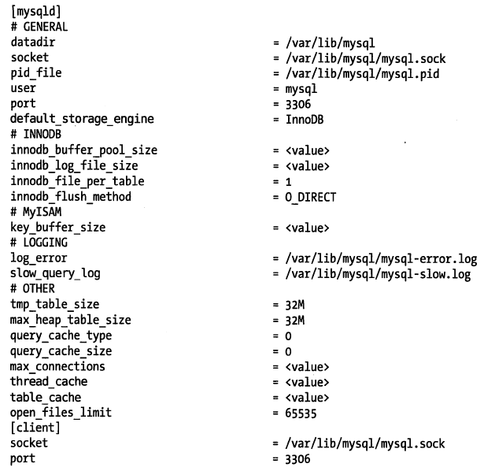
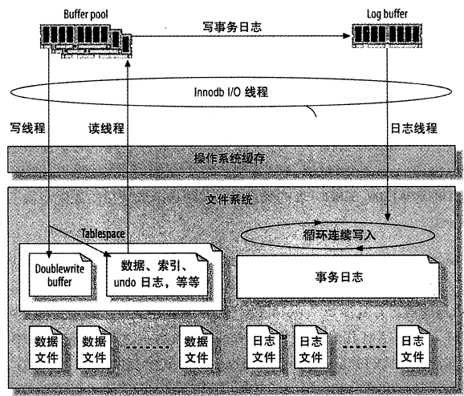

MySQL有大量可以修改的参数－－但不应该随便去修改。通常只需要把基本的项配置正确（大部分情况下只有很少一些参数是真正重要的），应该将更多的时间花在schema的优化、索引，以及查询设计上。在正确地配置了MySQL的基本配置项之后，再花力气去修改其它配置项的收益通常就比较小了。

#1.创建MySQL配置文件
建议不要使用操作系统的安装包自带的配置文件，最好从头开始创建一个配置文件。（首先要确定MySQL使用了哪个配置文件！）

#2.InnoDB缓冲池（Buffer Pool）
	有一个流行的经验法则说，应该把缓冲池大小设置为服务器内存的约75~80%，但并不总是正确的。有一个更好的办法来设置缓冲池大小，大致如下：
	1、从服务器内存总量开始
	2、减去操作系统的内存占用
	3、减去一些MySQL自身需要的内存
	4、减去足够让操作系统缓存InnoDB日志文件的内存，至少是足够缓存最近经常访问的部分。
	5、减去其他配置的MySQL缓冲和缓存需要的内存，例如查询缓存，MYISAM键缓存
	6、除以105%，把结果向下取一个合理的数值。

>如果大部分都是InnoDB表，InnoDB缓冲池或许比其他任何东西更需要内存。InnoDB缓冲池并不仅仅缓存索引：它还缓存行的数据、自适应哈希索引、插入缓存（Insert buffer）、锁、以及其他内部数据结构。
>
>InnoDB还使用缓冲池来帮助延迟写入，这样就能合并多个写入操作，然后一起顺序地写回。总之InnoDB严重依赖缓冲池，你必须确认为它分配了足够的内存。
>如果数据量不大，并且不会快速增长，就没必要为缓冲池分配过多的内存。把缓冲池配置得比需要缓存的表和索引还要大很多实际上没有什么意义。
>
>当然，对一个迅速增长的数据库做超前的规划没有问题，但有时我们也会看到一个巨大的缓冲池只缓存了一点点数据，这就没有必要了。
>很大的缓冲池也会带一些挑战，例如，预热和关闭都会花费很长的时间。如果有很多脏页在缓冲池里，InnoDB关闭时可能会花费较长的时间把脏页写回数据文件。当然也可以强制快速关闭，但是重启时就必须做更多的恢复工作。
>
>当脏页的百分比超过了innodb_max_dirty_pages_pct阈值，InnoDB将快速地刷写脏页，尝试让脏页的数量更低。当事务日志没有足够的空间剩余时，InnoDB将进入“激烈刷写”模式，这就是大日志可以提升性能的一个原因。
>
>如果不能快速预热，可以在重启后立即进行全表扫描或者索引扫描，把索引载入缓冲池。也可以使用init_file设置，把SQL放在一个文件里，然后当MySQL启动的时候来执行。

#3.线程缓存
>线程缓存保存那些当前没有与连接关联但是为后面新的连接服务的线程。当一个新的连接创建时，如果缓存中有线程存在，MySQL从缓存中删除一个线程，并且把它分配给这个新的连接。
>
>当连接关闭时，如果线程缓存还有空间的话，MySQL又会把线程放回缓存。如果没有空间的话，MySQL会销毁这个线程。只要MySQL在缓存里还有空闲的线程，它就可以迅速地响应连接请求，因为这样就不用为每个连接创建新的线程。
>
>一个好的办法是观察Threads_connected变量并且尝试设置thread_cache_size足够大以便能处理业务压力正常的波动。每个在线程缓存中的线程或者休眠状态的线程，通常使用256K左右的内存。相对于正在处理查询的线程来说，这个内存不算很大。

#4.表缓存
>表缓存可以重用资源。当一个查询请求访问一张MYISAM表，MySQL可以从缓存的对象中获取到文件描述符，避免打开一个文件描述符的开销。
>
>对MYISAM表来说，表缓存的真正好处是可以让服务器避免修改MYISAM文件头来标记表“正在使用中”，表缓存对于InnoDB重要性就小得多，因为InnoDB不依赖它来做那么多事，例如持有文件描述符等。

#5.InnoDB I/O配置（事务日志）

>InnoDB使用日志来减少提交事务时的开销。因为日志中已经记录了事务，就无须在每个事务提交时把缓冲池的脏块刷新(flush)到磁盘中。
>
>事务修改的数据和索引通常会映射到表空间的随机位置，所以刷新这些变更到磁盘需要很多随机IO。InnoDB假设使用常规磁盘，随机IO比顺序IO昂贵得多，因为一个IO请求需要时间把磁头移到正确的位置，然后等待磁盘上读出需要的部分，再转到开始位置。

>InnoDB用日志把随机IO变成顺序IO。一旦日志安全写到磁盘，事务就持久化了，即使断电了，InnoDB可以重放日志并且恢复已经提交的事务。

>InnoDB使用一个后台线程智能地刷新这些变更到数据文件。这个线程可以批量组合写入，使得数据写入更顺序，以提高效率。

>整体的日志文件大小受控于innodb_log_file_size和innodb_log_files_in_group两个参数，这对写性能非常重要。日志文件的总大小是每个文件的大小之和。

>InnoDB使用多个文件作为一组循环日志。通常不需要修改默认的日志数量，只修改每个日志文件的大小即可。要修改日志文件大小，需要完全关闭MySQL，将旧的日志文件移到其他地方保存，重新配置参数。

>要确定理想的日志文件大小，必须权衡正常数据变更的开销和崩溃恢复需要的时间，如果日志太小，InnoDB必然将做更多的检查点，导致更多的日志写。如果日志太大，在崩溃恢复时InnoDB可能不得不做大量的工作。

>当InnoDB变更任何数据时，会写一条变更记录到内存日志缓冲区中。==在缓冲满的时候，事务提交的时候，或者每一秒钟，这三个条件无论哪个先达到，InnoDB都会刷新缓冲区的内容到磁盘日志文件。==变量innodb_log_buffer_size可以控制日志缓冲区的大小，默认为1M。通常不需要把日志缓冲区设置得非常大。推荐的范围是1~8M。作为一个经验法则，日志文件的全部大小，应该足够容纳服务器一个小时的活动内容。
>
InnoDB怎么刷新日志缓冲？当InnoDB把日志缓冲刷新到磁盘日志文件时，会先使用一个Mutex锁住缓冲区，刷新到所需要的位置，然后移动剩下的条目到缓冲区的前面。日志缓冲必须被刷新到持久化存储，以确保提交的事务完全被持久化了。如果和持久相比更在乎性能，可以修改innodb_flush_log_at_trx_commit变量来控制日志缓冲刷新的频繁程度。可能的设置如下：

- 0：每秒一次把日志缓冲写到日志文件，但是事务提交时不做任何时。
- 1：将日志缓冲写到日志文件，然后每次事务提交都刷新到持久化存储（默认并且最安全的设置），该设置保证不会丢失任何已提交的事务。
- 2：每秒钟做一次刷新，但每次提交时把日志缓冲写到日志文件，但是不刷新到持久化存储。
“把日志缓冲写到日志文件”和“把日志刷新到持久化存储”是不同的。==在大部分操作系统中，把缓冲写到日志只是简单地把数据从InnoDB的内存缓冲转移到了操作系统的缓存，也是在内存里，并没有真正把数据写到持久化存储==。

>如果MySQL崩溃了或者断电了，设置0和2通常会导致最多1秒的数据丢失，因为数据可能存在于操作系统的缓存中。
相反，把日志刷新到持久化存储意味着InnoDB请求操作系统把数据刷出缓存，并且确认写到磁盘了，这是一个阻塞IO的调用，直到数据被完全写回才会完成，当写数据到磁盘比较慢，而该配置项设置为1时，可能明显地降低InnoDB每秒可以提交的事务数。

#6.InnoDB并发配置
InnoDB有自己的“线程调度器”控制线程怎么进入内核访问数据，以及它们在内核中一次可以做哪些事。最基本的限制并发方式是使用innodb_thread_concurrency变量，它会限制一次性可以有多少线程进入内核，0表示不限制。
理论上，可以参考下面的公式：并发值＝CPU数量*磁盘数量*2
另外，也可以通过线程池(Thread Pool)来限制并发。

#7.优化排序（Filesorts）
如果查询中所有需要的列和order by的列总大小超过max_length_for_sort_data字节，则采用two-pass算法，否则采用single-pass算法。

#8.其他配置项
1. max_connections：这个设置的作用就像一个紧急刹车，以保证服务器不会因应用程序激增的连接而不堪重负。如果应用程序有问题，或者服务器遇到如连接延迟的问题，会创建很多新连接，但是如果不能执行查询，那打开一个连接没有好处，所以被“太多的连接”的错误拒绝是一种快速而代价小的失败方式。
要时时小心可能遇到连接限制的突然袭击。例如，若重启应用服务器，可能没有把它的连接关闭干净，同时MySQL可能没有意识到它们已经被关闭了。当应用服务器重新开始运行，并试图打开到数据库的连接，就可能由于挂起的连接还没有超时，导致新连接被拒绝。观察max_used_connections状态变量随着时间的变化，如果这个值达到了max_connections，说明客户端至少被拒绝了一次。

2. thread_cahce_size:观察Threads_connected状态变量并且找到它在一般情况下的最大值和最小值。可以设置为波动范围2~3倍大小。但是也不用设置得非常大，因为保持大量等待连接的空闲线程并没有什么真正的用处。
也可以观察threads_created状态随时间的变化，如果这个值很大或者一直增长，这可能在告诉你，需要调大thread_cahce_size变量。查看threads_cached来看有多少线程已经在缓存中了。
另一个相关的状态变量是slow_launch_threads。这个状态如果很大，那么意味着某些情况延迟了连接分配新线程。一般来说可能是系统过载了，导致操作系统不能为新创建的线程调度CPU。

总之，如果使用的是InnoDB，最重要的配置项是以下两个：innodb_buffer_pool_size和innodb_log_file_size