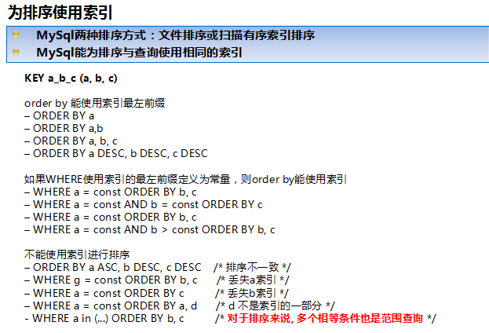

>索引（在MYSQL中也叫做键<key>），是存储引擎用于快速找到记录的一种数据结构。

>索引对查询的速度有着至关重要的影响，理解索引也是进行数据库性能调优的起点。考虑如下情况，假设数据库中一个表有10^6条记录，DBMS的页面大小为4K，并存储100条记录。
>
>如果没有索引，查询将对整个表进行扫描，最坏的情况下，如果所有数据页都不在内存，需要读取10^4个页面，如果这10^4个页面在磁盘上随机分布，需要进行10^4次I/O，假设磁盘每次I/O时间为10ms(忽略数据传输时间)，则总共需要100s(但实际上要好很多很多)。
>
>如果对之建立B-Tree索引，则只需要进行log100(10^6)=3次页面读取，最坏情况下耗时30ms。这就是索引带来的效果，很多时候，当你的应用程序进行SQL查询速度很慢时，应该想想是否可以建索引。
>
>索引优化应该是对查询性能优化最有效的手段了，索引能够轻易将查询性能提高几个数量级，”最优“的索引有时比一个”好的“索引性能要好两个数量级。创建一个真正”最优“的索引经常要重写查询。

#1.索引基础
	在MySQL中，存储引擎用一本书的“索引”找到对应页码类似的方法使用索引，其先在索引中找到对应值，然后根据匹配的索引记录找到对应的数据行。
	索引可以包含一个或多个列的值。如果索引包含多个列，那么列的顺序也十分重要，因为MySQL只能高效地使用索引的最左前缀列。
#2.索引与优化
##1、选择索引的数据类型
>MySQL支持很多数据类型，选择合适的数据类型存储数据对性能有很大的影响。通常来说，可以遵循以下一些指导原则：

	(1)越小的数据类型通常更好：越小的数据类型通常在磁盘、内存和CPU缓存中都需要更少的空间，处理起来更快。
	
	(2)简单的数据类型更好：整型数据比起字符，处理开销更小，因为字符串的比较更复杂。在MySQL中，应该用内置的日期和时间数据类型，而不是用字符串来存储时间；以及用整型数据类型存储IP地址。
	
	(3)尽量避免NULL：应该指定列为NOT NULL，除非你想存储NULL。在MySQL中，含有空值的列很难进行查询优化，因为它们使得索引、索引的统计信息以及比较运算更加复杂。你应该用0、一个特殊的值或者一个空串代替空值。

###1.1、选择标识符
>选择合适的标识符是非常重要的。选择时不仅应该考虑存储类型，而且应该考虑MySQL是怎样进行运算和比较的。一旦选定数据类型，应该保证所有相关的表都使用相同的数据类型。

	(1)    整型：通常是作为标识符的最好选择，因为可以更快的处理，而且可以设置为AUTO_INCREMENT。
	(2)    字符串：尽量避免使用字符串作为标识符，它们消耗更大的空间，处理起来也较慢。而且，通常来说，字符串都是随机的，所以它们在索引中的位置也是随机的，
	这会导致页面分裂、随机访问磁盘，聚簇索引分裂（对于使用聚簇索引的存储引擎）。
##2、索引入门
>对于任何DBMS，索引都是进行优化的最主要的因素。对于少量的数据，没有合适的索引影响不是很大，但是，当随着数据量的增加，性能会急剧下降。
>
>如果对多列进行索引(组合索引)，列的顺序非常重要，MySQL仅能对索引最左边的前缀进行有效的查找。例如：
>
```sql
假设存在组合索引it1c1c2(c1,c2)，查询语句
select * from t1 where c1=1 and c2=2能够使用该索引。
查询语句select * from t1 where c1=1也能够使用该索引。
但是，查询语句
	select * from t1 where c2=2不能够使用该索引，
	因为没有组合索引的引导列，即，要想使用c2列进行查找，必需出现c1等于某值。
```
###2.1、索引的类型
>索引是在存储引擎中实现的，而不是在服务器层中实现的。所以，每种存储引擎的索引都不一定完全相同，并不是所有的存储引擎都支持所有的索引类型。

####2.1.1、B-Tree索引
>B－Tree：每一个叶子节点都包含指向下一个叶子节点的指针，从而方便叶子节点的范围遍历。B－Tree通常意味着所有的值都是按顺序存储的，并且每一个叶子页到根的距离相同，很适合查找范围数据。


假设有如下一个表：

```sql
CREATE TABLE People (
   last_name varchar(50)    not null,
   first_name varchar(50)    not null,
   dob        date           not null,
   gender     enum('m', 'f') not null,
   key(last_name, first_name, dob)
);
```
 其索引包含表中每一行的last_name、first_name和dob列。其结构大致如下：
 


>索引存储的值按索引列中的顺序排列。可以利用B-Tree索引进行全关键字、关键字范围和关键字前缀查询，当然，如果想使用索引，你必须保证按索引的最左边前缀(leftmost prefix of the index)来进行查询。

- (1)匹配全值(Match the full value)：对索引中的所有列都指定具体的值。例如，上图中索引可以帮助你查找出生于1960-01-01的Cuba Allen。
- (2)匹配最左前缀(Match a leftmost prefix)：你可以利用索引查找last name为Allen的人，仅仅使用索引中的第1列。
- (3)匹配列前缀(Match a column prefix)：例如，你可以利用索引查找last name以J开始的人，这仅仅使用索引中的第1列。
- (4)匹配值的范围查询(Match a range of values)：可以利用索引查找last name在Allen和Barrymore之间的人，仅仅使用索引中第1列。
- (5)匹配部分精确而其它部分进行范围匹配(Match one part exactly and match a range on another part)：可以利用索引查找last name为Allen，而first name以字母K开始的人。
- (6)仅对索引进行查询(Index-only queries)：如果查询的列都位于索引中，则不需要读取元组的值。(覆盖索引)
由于B-树中的节点都是顺序存储的，所以可以利用索引进行查找(找某些值)，也可以对查询结果进行ORDER BY。

>当然，使用B-tree索引有以下一些限制：

- (1) 查询必须从索引的最左边的列开始，否则无法使用索引。关于这点已经提了很多遍了。例如你不能利用索引查找在某一天出生的人。
- (2) 不能跳过某一索引列。例如，你不能利用索引查找last name为Smith且出生于某一天的人。
- (3) 存储引擎不能使用索引中范围条件右边的列。例如，如果你的查询语句为WHERE last_name="Smith" AND first_name LIKE 'J%' AND dob='1976-12-23'，则该查询只会使用索引中的前两列，因为LIKE是范围查询。

####2.1.2、Hash索引
>哈希索引基于哈希表实现，只有精确索引所有列的查询才有效。对于每一行数据，存储引擎都会对所有的索引列计算一个哈希码，哈希码是一个较小的值，并且不同键值的行计算出来的哈希码也不一样。哈希索引将所有的哈希存储在索引中，同时在哈希表中保存指向每个数据的指针。

>MySQL中，只有Memory存储引擎显示支持hash索引，是Memory表的默认索引类型，尽管Memory表也可以使用B-Tree索引。Memory存储引擎支持非唯一hash索引，这在数据库领域是罕见的，如果多个值有相同的hash code，索引把它们的行指针用链表保存到同一个hash表项中。

假设创建如下一个表：

```sql
CREATE TABLE testhash (
   fname VARCHAR(50) NOT NULL,
   lname VARCHAR(50) NOT NULL,
   KEY USING HASH(fname)
) ENGINE=MEMORY;
```
包含的数据如下：


假设索引使用hash函数f( )，如下：
f('Arjen') = 2323
f('Baron') = 7437
f('Peter') = 8784
f('Vadim') = 2458
此时，索引的结构大概如下：

 
 
>哈希索引中存储的是：哈希值+数据行指针 
Slots是有序的，但是记录不是有序的。当你执行

```sql
mysql> SELECT lname FROM testhash WHERE fname='Peter';
```
>MySQL会计算’Peter’的hash值，然后通过它来查询索引的行指针。因为f('Peter') = 8784，MySQL会在索引中查找8784，得到指向记录3的指针。
>
>因为索引自己仅仅存储很短的值，所以，索引非常紧凑。Hash值不取决于列的数据类型，一个TINYINT列的索引与一个长字符串列的索引一样大。
 
>Hash索引有以下一些限制：

	(1)由于索引仅包含hash code和记录指针，所以，MySQL不能通过使用索引避免读取记录。但是访问内存中的记录是非常迅速的，不会对性造成太大的影响。
	(2)不能使用hash索引排序。
	(3)Hash索引不支持键的部分匹配，因为是通过整个索引值来计算hash值的。
	(4)Hash索引只支持等值比较，例如使用=，IN( )和<=>。对于WHERE price>100并不能加速查询。
	(5)访问Hash索引的速度非常快，除非有很多哈希冲突（不同的索引列值却有相同的哈希值）。
	当出现哈希冲突的时候，存储引擎必须遍历链表中所有的行指针，逐行进行比较，直到找到所有符合条件的行。
	(6)如果哈希冲突很多的话，一些索引维护操作的代价也会很高。当从表中删除一行时，存储引擎要遍历对应哈希值的链表中的每一行，找到并删除对应行的引用，冲突越多，代价越大。

>InnoDB引擎有一个特殊的功能叫做“自适应哈希索引”。当InnoDB注意到某些索引值被使用得非常频繁时，它会在内存中基于B-Tree索引 上再创建一个哈希索引，这样就上B-Tree索引也具有哈希索引的一些优点，比如快速的哈希查找。
>
>创建哈希索引：如果存储引擎不支持哈希索引，则可以模拟像InnoDB一样创建哈希索引，这可以享受一些哈希索引的便利，例如只需要很小的索引就可以为超长的键创建索引。
>
>思路很简单：在B-Tree基础上创建一个伪哈希索引。这和真正的哈希索引不是一回事，因为还是使用B-Tree进行查找，但是它使用哈希值而不是键本身进行索引查找。
>
>你需要做的就是在查询的where子句中手动指定使用哈希函数。这样实现的缺陷是需要维护哈希值。可以手动维护，也可以使用触发器实现。
>
>如果采用这种方式，记住不要使用SHA1和MD5作为哈希函数。因为这两个函数计算出来的哈希值是非常长的字符串，会浪费大量空间，比较时也会更慢。SHA1和MD5是强加密函数，设计目标是最大限度消除冲突，但这里并不需要这样高的要求。简单哈希函数的冲突在一个可以接受的范围，同时又能够提供更好的性能。
>
>如果数据表非常大，CRC32会出现大量的哈希冲突，CRC32返回的是32位的整数，当索引有93000条记录时出现冲突的概率是1%。
>
>处理哈希冲突：当使用哈希索引进行查询时，必须在where子句中包含常量值。

####2.1.3、空间(R-Tree)索引
>MyISAM支持空间索引，主要用于地理空间数据类型，例如GEOMETRY。

####2.1.4、全文(Full-text)索引
>全文索引是MyISAM的一个特殊索引类型，它查找的是文本中的关键词主要用于全文检索。

###索引的优点：
>最常见的B-Tree索引，按照顺序存储数据，所以MYSQL可以用来做order by和group by操作。因为数据是有序的，所以B-Tree也就会将相关的列值存储在一起。最后，因为索引中存储了实际的列值，所以某些查询只使用索引就能够完成全部查询。
>总结下来索引有如下三个优点：

	1，索引大大减小了服务器需要扫描的数据量
	2，索引可以帮助服务器避免排序和临时表
	3，索引可以将随机IO变成顺序IO
>索引三星系统：

	一星：索引将相关的记录放到一起
	二星：索引中的数据顺序和查找中的排列顺序一致
	三星：索引中的列包含了查询中需要的全部列

###索引是最好的解决方案吗？
>索引并不总是最好的工具。总的来说只有索引帮助存储引擎快速查找到记录的好处大于其带来的额外工作时，索引才是有效的。
	
	对于非常小的表，大部分情况下简单的全表扫描更高效；
	对于中到大型的表，索引就非常有效。
	但对于特大型的表，建立和使用索引的代价将随之增长。这种情况下需要一种技术可以直接区分出查询需要的一组数据，而不是一条记录一条记录地匹配。例如使用分区技术。
	如果表的数量特别多，可以建立一个元数据信息表，用来查询需要用到的某些特性。例如执行那些需要聚合多个应用分布在多个表的数据的查询，
	则需要记录“哪个用户的信息存储在哪个表中”的元数据，这样在查询时就可以直接忽略那些不包含指定用户信息的表。

#3、高性能的索引策略
##3.1独立的列
>独立的列是指索引列不能是表达式的一部分，也不是是函数的参数。例如以下两个查询无法使用索引：

```sql
1）表达式：  select actor_id from sakila.actor where actor_id+1=5;
2）函数参数：select ... where TO_DAYS(CURRENT_DATE) - TO_DAYS(date_col)<=10;
```
##3.2前缀索引和索引选择性
>通常可以索引开始的部分字符，这样可以大大节约索引空间，从而提高索引效率。但这样也会降低索引的选择性。索引的选择性是指，不重复的索引值（基数）和数据表中的记录总数（#T）的比值，范围从1/#T之间。
>
>索引的选择性越高则查询效率越高，因为选择性高的索引可以让MYSQL在查找时过滤掉更多的行。
>
>唯一索引的选择性是1，这是最好的索引选择性，性能也是最好的。
>
>一般情况下某个前缀的选择性也是足够高的，足以满足查询性能。对于BLOB、TEXT或者很长的VARCHAR类型的列，必须使用前缀索引，因为MYSQL不允许索引这些列的完整长度。
>
>决窍在于要选择足够长的前缀以保证较高的选择性，同时又不能太长（以便节约空间）。前缀应该足够长，以使得前缀索引的选择性接近于索引整个列。换句话说，前缀的“基数”应该接近于完整列的“基数”。

>为了决定前缀的合适长度，需要找到最常见的值的列表，然后和最常见的前缀列表进行比较。例如以下查询：

```sql
select count(*) as cnt,city from sakila.city_demo group by city order by cnt desc limit 10;
select count(*) as cnt,left(city,7) as perf  from sakila.city_demo group by city order by cnt desc limit 10;
```
直到这个前缀的选择性接近完整列的选择性。
>计算合适的前缀长度的另一个方法就是计算完整列的选择性，并使前缀的选择性接近于完整列的选择性，如下：


```sql
select  count(distinct city)/count(*) from sakila.city_demo;
select  count(distinct left(city,7))/count(*) from sakila.city_demo;
```
>前缀索引是一种能使索引更小、更快的有效办法，但另一方面也有其缺点：MYSQL无法使用前缀索引做order by和group by，也无法使用前缀索引做覆盖扫描。

##3.3多列索引
>一个多列索引与多个列索引MYSQL在解析执行上是不一样的，如果在explain中看到有索引合并，应该好好检查一下查询的表和结构是不是已经最优。

##3.4选择合适的索引列顺序
>对于如何选择索引的顺序有一个经验法则：将选择性最高的列放在索引最前列。
>
>当不需要考虑排序和分组时，将选择性最高的列放在前面通常是最好的。然后，性能不只是依赖于所有索引列的选择性（整体基数），也和查询条件的具体值有关，也就是和值的分布有关。
>
>这和前面介绍的选择前缀的长度需要考虑的地方一样。可能需要根据那些运行频率最高的查询来调整索引列的顺序，让这种情况下索引的选择性最高。
>
>使用经验法则要注意不要假设平均情况下的性能也能代表特殊情况下的性能，特殊情况可能会摧毁整个应用的性能（当使用前缀索引时，在某些条件值的基数比正常值高的时候）。

##3.5、聚簇索引(Clustered Indexes)
>聚簇索引保证关键字的值相近的元组存储的物理位置也相同（所以字符串类型不宜建立聚簇索引，特别是随机字符串，会使得系统进行大量的移动操作），且一个表只能有一个聚簇索引。
>
>因为由存储引擎实现索引，所以，并不是所有的引擎都支持聚簇索引。目前，只有solidDB和InnoDB支持。

>聚簇索引的结构大致如下：

	叶子页包含了行的全部数据，但是节点页只包含了索引列。
	二级索引叶子节点保存的不是指行的物理位置的指针，而是行的主键值。
	这意味着通过二级索引查找行，存储引擎需要找到二级索引的叶子节点获取对应的主键值，然后根据这个值去聚簇索引中查找到对应的行。
	这里做了重复的工作：两次B－TREE查找而不是一次。


>注：叶子页面包含完整的元组，而内节点页面仅包含索引的列(索引的列为整型)。一些DBMS允许用户指定聚簇索引，但是MySQL的存储引擎到目前为止都不支持。
>
>InnoDB对主键建立聚簇索引。如果你不指定主键，InnoDB会用一个具有唯一且非空值的索引来代替。如果不存在这样的索引，InnoDB会定义一个隐藏的主键，然后对其建立聚簇索引。一般来说，DBMS都会以聚簇索引的形式来存储实际的数据，它是其它二级索引的基础。

###3.5.1、InnoDB和MyISAM的数据布局的比较
>为了更加理解聚簇索引和非聚簇索引，或者primary索引和second索引(MyISAM不支持聚簇索引)，来比较一下InnoDB和MyISAM的数据布局，对于如下表：

```sql
CREATE TABLE layout_test (
   col1 int NOT NULL,
   col2 int NOT NULL,
   PRIMARY KEY(col1),
   KEY(col2)
);
```
 假设主键的值位于1---10,000之间，且按随机顺序插入，然后用OPTIMIZE TABLE进行优化。col2随机赋予1---100之间的值，所以会存在许多重复的值。
 
- (1)    MyISAM的数据布局
其布局十分简单，MyISAM按照插入的顺序在磁盘上存储数据，如下：


 注：左边为行号(row number)，从0开始。因为元组的大小固定，所以MyISAM可以很容易的从表的开始位置找到某一字节的位置。
MyISAM建立的primary key的索引结构大致如下：


 注：MyISAM不支持聚簇索引，索引中每一个叶子节点仅仅包含行号(row number)，且叶子节点按照col1的顺序存储。
来看看col2的索引结构：


 实际上，在MyISAM中，primary key和其它索引没有什么区别。Primary key仅仅只是一个叫做PRIMARY的唯一，非空的索引而已，叶子节点按照col2的顺序存储。

(2)    InnoDB的数据布局
InnoDB按聚簇索引的形式存储数据，所以它的数据布局有着很大的不同。它存储表的结构大致如下：


 注：聚簇索引中的每个叶子节点包含primary key的值，事务ID和回滚指针(rollback pointer)——用于事务和MVCC，和余下的列(如col2)。

相对于MyISAM，InnoDB的二级索引与聚簇索引有很大的不同。InnoDB的二级索引的叶子包含primary key的值，而不是行指针(row pointers)，这样的策略减小了移动数据或者数据页面分裂时维护二级索引的开销，因为InnoDB不需要更新索引的行指针。其结构大致如下：


 聚簇索引和非聚簇索引表的对比：
 


###3.5.2、按primary key的顺序插入行(InnoDB)
>如果你用InnoDB，而且不需要特殊的聚簇索引，一个好的做法就是使用代理主键(surrogate key)——独立于你的应用中的数据。最简单的做法就是使用一个AUTO_INCREMENT的列，这会保证记录按照顺序插入，而且能提高使用primary key进行连接的查询的性能。应该尽量避免随机的聚簇主键，例如，字符串主键就是一个不好的选择，它使得插入操作变得随机。
 
##3.6、覆盖索引(Covering Indexes)
>覆盖索引是一种非常强大的工具，能大大提高查询性能。设计优秀的索引应该考虑到整个查询，而不单单的where条件部分。
>
>索引确实是一种查找数据的高效方式，但是MYSQL也可以使用索引来直接获取列的数据，这样就不再需要读取数据行。索引的叶子节点中已经包含要查询的数据，那么就没有必要再回表查询了，如果索引包含满足查询的所有数据，就称为覆盖索引。
>
>只需要读取索引而不用读取数据有以下一些优点：

	(1)索引项通常比记录要小，所以MySQL访问更少的数据；
	(2)索引都按值的大小顺序存储，相对于随机访问记录，需要更少的I/O；
	(3)大多数据引擎能更好的缓存索引。比如MyISAM只缓存索引。
	(4)覆盖索引对于InnoDB表尤其有用，因为InnoDB使用聚集索引组织数据，如果二级索引中包含查询所需的数据，就不再需要在聚集索引中查找了。
	
>覆盖索引不能是任何索引，只有B-TREE索引存储相应的值。而且不同的存储引擎实现覆盖索引的方式都不同，并不是所有存储引擎都支持覆盖索引(Memory和Falcon就不支持)。
>
>对于索引覆盖查询(index-covered query)，使用EXPLAIN时，可以在Extra一列中看到“Using index”。例如，在sakila的inventory表中，有一个组合索引(store_id,film_id)，对于只需要访问这两列的查询，MySQL就可以使用索引，如下：

```sql
mysql> EXPLAIN SELECT store_id, film_id FROM sakila.inventory\G
*************************** 1. row ***************************
           id: 1
 select_type: SIMPLE
        table: inventory
         type: index
possible_keys: NULL
          key: idx_store_id_film_id
      key_len: 3
          ref: NULL
         rows: 5007
        Extra: Using index
1 row in set (0.17 sec)
```
在大多数引擎中，只有当查询语句所访问的列是索引的一部分时，索引才会覆盖。但是，InnoDB不限于此，InnoDB的二级索引在叶子节点中存储了primary key的值。因此，sakila.actor表使用InnoDB，而且对于是last_name上有索引，所以，索引能覆盖那些访问actor_id的查询，如：
（同时查询actor_id[主键]与last_name[索引字段]）
 
```sql
mysql> EXPLAIN SELECT actor_id, last_name
    -> FROM sakila.actor WHERE last_name = 'HOPPER'\G
*************************** 1. row ***************************
           id: 1
 select_type: SIMPLE
        table: actor
         type: ref
possible_keys: idx_actor_last_name
          key: idx_actor_last_name
      key_len: 137
          ref: const
         rows: 2
        Extra: Using where; Using index
```
##3.7、利用索引进行排序
>MySQL中，有两种方式生成有序结果集：一是使用filesort，二是按索引顺序扫描。
>
>如果explain出来的type列的值为“index”，则说明MYSQL使用了索引扫描来做排序。利用索引进行排序操作是非常快的，因为只需要从一条索引记录移动到紧接着的下一条记录。
>
>但如果索引不能覆盖查询所需的全部列，那就不得不每扫描一条索引记录就回表查询一次对应的行，这基本上都是随机IO，因此按索引顺序读取的速度通常要比顺序地全表扫描慢，尤其是在IO密集型的工作负载时。
>
>而且可以利用同一索引同时进行查找和排序操作。当索引的顺序与ORDER BY中的列顺序相同且所有的列是同一方向(全部升序或者全部降序)时，可以使用索引来排序。如果查询是连接多个表，仅当ORDER BY中的所有列都是第一个表的列时才会使用索引。其它情况都会使用filesort文件排序。

```sql
create table actor(
actor_id int unsigned NOT NULL AUTO_INCREMENT,
name      varchar(16) NOT NULL DEFAULT '',
password        varchar(16) NOT NULL DEFAULT '',
PRIMARY KEY(actor_id),
 KEY     (name)
) ENGINE=InnoDB
insert into actor(name,password) values('cat01','1234567');
insert into actor(name,password) values('cat02','1234567');
insert into actor(name,password) values('ddddd','1234567');
insert into actor(name,password) values('aaaaa','1234567');
 
mysql> explain select actor_id from actor order by actor_id \G
*************************** 1. row ***************************
           id: 1
 select_type: SIMPLE
        table: actor
         type: index
possible_keys: NULL
          key: PRIMARY
      key_len: 4
          ref: NULL
         rows: 4
        Extra: Using index
1 row in set (0.00 sec)
 
mysql> explain select actor_id from actor order by password \G
*************************** 1. row ***************************
           id: 1
 select_type: SIMPLE
        table: actor
         type: ALL
possible_keys: NULL
          key: NULL
      key_len: NULL
          ref: NULL
         rows: 4
        Extra: Using filesort
1 row in set (0.00 sec)
 
mysql> explain select actor_id from actor order by name \G
*************************** 1. row ***************************
           id: 1
 select_type: SIMPLE
        table: actor
         type: index
possible_keys: NULL
          key: name
      key_len: 18
          ref: NULL
         rows: 4
        Extra: Using index
1 row in set (0.00 sec)
```
> 当MySQL不能使用索引进行排序时，就会利用自己的排序算法(快速排序算法)在内存(sort buffer)中对数据进行排序，如果内存装载不下，它会将磁盘上的数据进行分块，再对各个数据块进行排序，然后将各个块合并成有序的结果集（实际上就是外排序，使用临时表）。
> 
对于filesort，MySQL有两种排序算法。

- (1)两次扫描算法(Two passes)
实现方式是先将需要排序的字段和可以直接定位到相关行数据的指针信息取出，然后在设定的内存（通过参数sort_buffer_size设定）中进行排序，完成排序之后再次通过行指针信息取出所需的Columns。
>注：该算法是4.1之前采用的算法，它需要两次访问数据，尤其是第二次读取操作会导致大量的随机I/O操作。另一方面，内存开销较小。

- (2)一次扫描算法(single pass)
该算法一次性将所需的Columns全部取出，在内存中排序后直接将结果输出。

>注：从 MySQL 4.1 版本开始使用该算法。它减少了I/O的次数，效率较高，但是内存开销也较大。如果我们将并不需要的Columns也取出来，就会极大地浪费排序过程所需要的内存。
>
>在 MySQL 4.1 之后的版本中，可以通过设置 max_length_for_sort_data 参数来控制 MySQL 选择第一种排序算法还是第二种。
>
>当取出的所有大字段总大小大于 max_length_for_sort_data 的设置时，MySQL 就会选择使用第一种排序算法，反之，则会选择第二种。为了尽可能地提高排序性能，我们自然更希望使用第二种排序算法，所以在 Query 中仅仅取出需要的 Columns 是非常有必要的。


当对连接操作进行排序时，如果ORDER BY仅仅引用第一个表的列，MySQL对该表进行filesort操作，然后进行连接处理，此时，EXPLAIN输出“Using filesort”；否则，MySQL必须将查询的结果集生成一个临时表，在连接完成之后进行filesort操作，此时，EXPLAIN输出“Using temporary;Using filesort”。
 



##3.8、索引与加锁
>索引对于InnoDB非常重要，因为它可以让查询锁更少的元组。这点十分重要，因为MySQL 5.0中，InnoDB直到事务提交时才会解锁。
>
>有两个方面的原因：首先，即使InnoDB行级锁的开销非常高效，内存开销也较小，但不管怎么样，还是存在开销。其次，对不需要的元组的加锁，会增加锁的开销，降低并发性。
>
>InnoDB仅对需要访问的元组加锁，而索引能够减少InnoDB访问的元组数。但是，只有在存储引擎层过滤掉那些不需要的数据才能达到这种目的。
>
>一旦索引不允许InnoDB那样做（即达不到过滤的目的），MySQL服务器只能对InnoDB返回的数据进行WHERE操作，此时，已经无法避免对那些元组加锁了：InnoDB已经锁住那些元组，服务器无法解锁了。

```sql
来看个例子：
create table actor(
actor_id int unsigned NOT NULL AUTO_INCREMENT,
name      varchar(16) NOT NULL DEFAULT '',
password        varchar(16) NOT NULL DEFAULT '',
PRIMARY KEY(actor_id),
 KEY     (name)
) ENGINE=InnoDB
insert into actor(name,password) values('cat01','1234567');
insert into actor(name,password) values('cat02','1234567');
insert into actor(name,password) values('ddddd','1234567');
insert into actor(name,password) values('aaaaa','1234567');
SET AUTOCOMMIT=0;
BEGIN;
SELECT actor_id FROM actor WHERE actor_id < 4
AND actor_id <> 1 FOR UPDATE;
 该查询仅仅返回2---3的数据，实际已经对1---3的数据加上排它锁了。InnoDB锁住元组1是因为MySQL的查询计划仅使用索引进行范围查询（而没有进行过滤操作，WHERE中第二个条件已经无法使用索引了）：
mysql> EXPLAIN SELECT actor_id FROM test.actor
    -> WHERE actor_id < 4 AND actor_id <> 1 FOR UPDATE \G
*************************** 1. row ***************************
           id: 1
 select_type: SIMPLE
        table: actor
         type: index
possible_keys: PRIMARY
          key: PRIMARY
      key_len: 4
          ref: NULL
         rows: 4
        Extra: Using where; Using index
1 row in set (0.00 sec)
 
mysql>
```
 表明存储引擎从索引的起始处开始，获取所有的行，直到actor_id<4为假，服务器无法告诉InnoDB去掉元组1。
为了证明row 1已经被锁住，我们另外建一个连接，执行如下操作：

```sql
SET AUTOCOMMIT=0;
BEGIN;
SELECT actor_id FROM actor WHERE actor_id = 1 FOR UPDATE;
```
 该查询会被挂起，直到第一个连接的事务提交释放锁时，才会执行（这种行为对于基于语句的复制(statement-based replication)是必要的）。
 
如上所示，当使用索引时，InnoDB会锁住它不需要的元组。更糟糕的是，如果查询不能使用索引，MySQL会进行全表扫描，并锁住每一个元组，不管是否真正需要。